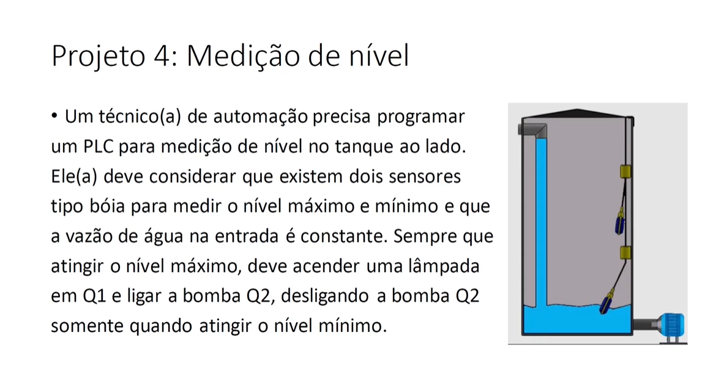
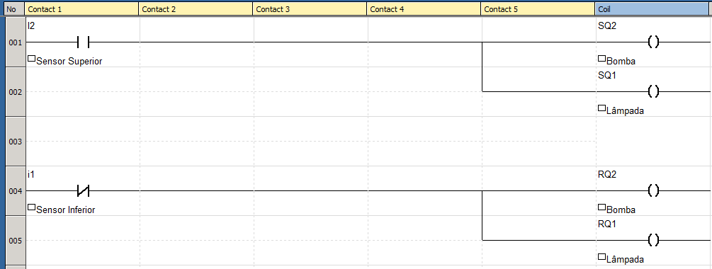

# 
 Level-Measurement 

## Goal

This is a Level Measurement project that I have created using ladder language as one of the projects required in the course [Treinamento em Lógica Ladder para CLP/PLC](https://www.udemy.com/course/treinamento-em-logica-ladder-para-plc/)

## Requirements 

The requirements to this project are described in the image bellow. 

## Implementation 

The program was created using ZelioSoft2 software, which is one of the software created by Schneider Electrics for Ladder programming on their Zelio series PLCs.

The ladder program is show bellow

In this program I1 refers to the bottom sensor, I2 refers to the top sensor Q2 refers to the water pump and Q1 refers to the lamp bulb.

## Notes and Concepts Learned  

I had to remember that the Latch Activation (Set) coil and the Latch Deactivation (Reset) coil are activated on the rising edge. That's the reason why I had to invert the state of input I1. Also, it's always a bit confusing to work with inversion.

